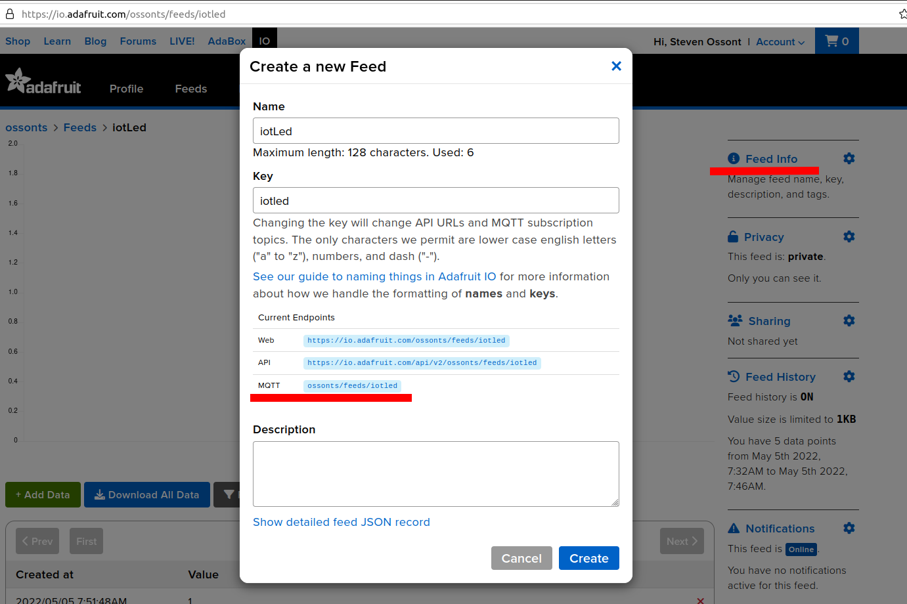

<!-- Updates to this file will be overwritten -->
<!-- markdown-link-check-disable -->

|  School of Computing |  |
| --------------- | --------------- |
| Title | Internet of Things |
| Module Coordinator| Uchenna Ogenyi |
| Email | [uchenna.ogenyi@port.ac.uk](mailto:uchenna.ogenyi@port.ac.uk) |
| Code | M30226|
| Moodle | [https://moodle.port.ac.uk/course/view.php?id=15563](https://moodle.port.ac.uk/course/view.php?id=15563) |

<!-- markdown-link-check-enable -->
## Internet of Things

Learning objectives:
<!-- TODO -->

* MQTT

### Notes and Advice

<!-- markdown-link-check-disable -->
* The [Extenuating Circumstances procedure](https://www.upsu.net/advice) is
  there to support you if you have had any circumstances (problems) that have
  been serious or significant enough to prevent you from attending, completing
  or submitting an assessment on time.
* [ASDAC](http://www2.port.ac.uk/additional-support-and-disability-advice-centre/)
  are available to any students who disclose a disability or require additional
  support for their academic studies with a good set of resources on the [ASDAC
  Moodle site](https://moodle.port.ac.uk/course/view.php?id=3012)
* The University takes plagiarism seriously. Please ensure you adhere to the
  plagiarism guidelines [https://www.upsu.net/advice/plagiarism](https://www.upsu.net/advice/plagiarism).
* Any material included in your coursework should be
  fully cited and referenced in APA format (**seventh** edition). Detailed advice on
  referencing is available from [http://referencing.port.ac.uk/](http://referencing.port.ac.uk/)
* Any material submitted that does not meet format or submission guidelines, or
  falls outside of the submission deadline could be subject to a cap on your
  overall result or disqualification entirely.
* If you need additional assistance, you can ask your personal tutor, learning
  support ana.baker@port.ac.uk and xia.han@port.ac.uk or your lecturers.
<!-- markdown-link-check-enable-->

### Lab Notes

* Feel free to add any notes to the `LabNotes.md` file in this repo. (The Pandoc worker will convert these to a PDF if you need)
* You can remove the `README.md` line from the `Pandoc.yml` file if you only want your notes in the PDF

### Lab 8.1 MQTT Client

* Be sure you understand what MQTT is and how it operates.
* Install an MQTT client, this will help with debugging.

You can use any client your want, MQTT Explorer is a good option. You will need to be able to subscribe to an MQTT topic so you can see any messages that get sent from your device or from the broker.

* [https://mqtt-explorer.com/](https://mqtt-explorer.com/)
* [https://github.com/emqx/MQTTX](https://github.com/emqx/MQTTX)

### Lab 8.1 Register for AdaFruit

The bespoke platform of https://io.adafruit.com/ has a
user-friendly dashboard will be adopted as the broker for this lab.

There are others
brokers like https://iot.eclipse.org/getting-started/.


Register an account with adafruit.com if you do not already have one.


> Refer to this documentation on the adafruit capabilities. [https://io.adafruit.com/api/docs](https://io.adafruit.com/api/docs)

### Lab 8.2 Create a feed

Create a new feed, give it a name and note down the MQTT topic name



### Lab 8.3 New dashboard

Create a new dashboard that will be used to store your blocks (Things you can visualise)


### Lab 8.4 Add a new block

Add a new block to the dashboard, use a toggle button. Be sure to read/look at all the different types of blocks that you can add to a dashboard.


### Lab 8.5 Connect using the desktop client

To be sure your credentials are correct, get your key and connect your MQTT client.

* Get your keys, do not share your keys. You can do this by clicking on the key symbol. 

    s

* Connect the client- Note the password refers to the key you generated from adafruit and not your login password. Username remains the same. 

    

* Change the toggle button on your dashboard, it should result in a message being sent to your client. Then sent a message from your client to adafruit. Do not proceed until you have established this two way communication.
* Note that the topic name must be all lower case. 

    

### Lab 8.6 Libraries

Connect your ESP-01 to your arduino and import these libraries (install if needed)

```c
#include <WiFiEsp.h>
#include <WiFiEspClient.h>
#include <SoftwareSerial.h>
#include <PubSubClient.h>
```

You will need to setup an access point and connect your ESP-01 to your WiFi. (A wifi connection is required). Define some constants, a server, port and your credentials.

```c
#define MQTT_SERVER  "io.adafruit.com"
#define IO_USERNAME  "USERNAME_HERE"
#define IO_KEY       "aio_SECRETKEYEkuK"
#define MQTT_PORT 1883
```

Create an MQTT client object

```c
WiFiEspClient WiFiClient;//WiFi
PubSubClient client(MQTT_SERVER, MQTT_PORT, WiFiClient); //MQTT Client
```

### Lab 8.7 Setup function

In your setup function you will need to:

* Setup the serial connections
* Connect to your WiFi
* Set a callback

A callback is a function that will be called when data is received from the broker.(Use an empty function for now)

```c
void callback(char* topic, byte* payload, unsigned int length) {
  //EMPTY
}

void setup()
{
  // initialize serial for debugging
  Serial.begin(9600);
  // initialize serial for ESP module
  Serial1.begin(9600);
  // initialize ESP module
  WiFi.init(&Serial1);

  // check for the presence of the shield
  if (WiFi.status() == WL_NO_SHIELD) {
    Serial.println("WiFi shield not present");
    // don't continue
    while (true);
  }

  // attempt to connect to WiFi network
  while ( status != WL_CONNECTED) {
    Serial.print("Attempting to connect to WPA SSID: ");
    Serial.println(ssid);
    // Connect to WPA/WPA2 network
    status = WiFi.begin(ssid, pass);
  }

  // you're connected now, so print out the data
  Serial.println("You're connected to the network");

  printWifiStatus();

  client.setCallback(callback);
}
```

Check this builds

### Lab8.10 Main loop

Now define a main loop, this will check to see if the broker is connected, and if not run a connection function, else it will call the client loop (MQTT main code)

```c

void reconnect() {
  //TODO: add some code
}

void loop()
{

  if (!client.connected()) {
    reconnect();
  }
  client.loop();

}
```

### Lab 8.11 Connect

Now lets write the connection code, this will be run every time the main loop detects that a connection has not already been established. We will connect to the `led` topic and send the value `off`. Then we will subscribe to the topic so that we get notifications if there is any new data on this topic (e.g. press button on dashboard, or send data via MQTT client)

* Set your topic feed names correctly.
* If we fail to connect, wait a bit and then retry.

```c

void reconnect() {
  // Loop until we're reconnected
  while (!client.connected()) {
    Serial.print("Attempting MQTT connection...");
    // Attempt to connect
    if (client.connect("arduinoClient",IO_USERNAME,IO_KEY)) {
      Serial.println("connected");
      // Once connected, publish an announcement...
      client.publish("ossonts/feeds/iotled","OFF");
      // ... and resubscribe
      client.subscribe("ossonts/feeds/iotled");
    } else {
      Serial.print("failed, rc=");
      Serial.print(client.state());
      Serial.println(" try again in 5 seconds");
      // Wait 5 seconds before retrying
      delay(5000);
    }

  }
}
```

Run this code. When this starts it will turn your topic to `OFF` be sure that you can see this value change on your dashboard and in the MQTT client (Set it to `ON` and then reboot arduino). Do not proceed until you can see these messages.

### Lab 8.12 React to data

Now lets get the callback to log any data we receive. Remember there are data limits, so dont send data too fast.

```c
void callback(char* topic, byte* payload, unsigned int length) {
  Serial.print("Message arrived [");
  Serial.print(topic);
  Serial.print("] ");
  //One way to access the payload message
  for (int i=0;i<length;i++) {
    Serial.print((char)payload[i]);
  }
}
  ```

Ensure this function is triggered when your toggle the button on your dashboard / or in the MQTT client.

Imagine that your arduino has a sense of humour. Every time your turn the button `ON` the arduino should turn it `OFF`.

* Be sure to set the correct topic
* Check you can see the messages in your MQTT Client

```c
void callback(char* topic, byte* payload, unsigned int length) {
  Serial.print("Message arrived [");
  Serial.print(topic);
  Serial.print("] ");
  //One way to access the payload message
  for (int i=0;i<length;i++) {
    Serial.print((char)payload[i]);
  }
  //Another way to get the payload message
  payload[length] = '\0';
  char* msg = (char*)payload;
  Serial.print("===\n");
  Serial.print(msg);
  Serial.print("===\n");

  //Strings can be tricky, so use the string compare function
  if(strcmp(msg,"ON")==0){
    client.publish("ossonts/feeds/iotled","OFF");
    delay(5000);

  }
}
```

### Lab 8.13

1. Connect an LED to your arduino. Now use the button on adafruit to turn the LED on and off.
2. (Optional) Can you send temperature values and draw a graph?
